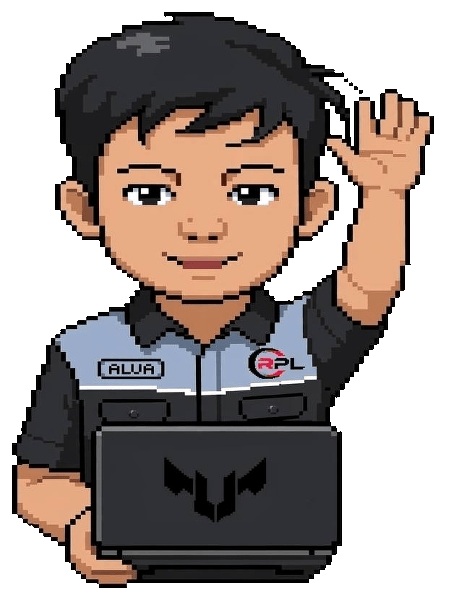

<div align="center">


<div align="center">



<br><br>


<br>

### 👋 Hi, I'm Alifandra

💜 Passionate about building modern web applications and immersive games.

🎮 Unity Developer • 🌐 Front-end Developer • ⚡ Laravel Enthusiast

</div>
<!--

-->

---

## 💜 About Me

```php
<?php

class Developer
{
    public string $name = "Alifandra Moamar Farizy";
    public string $location = "Indonesia 🇮🇩";

    public array $roles = [
        "Web Developer",
        "Game Developer"
    ];

    public array $currentlyLearning = [
        "Next.js",
        "Laravel",
        "Unity",
        "Blender"
    ];
}

$me = new Developer();

echo "Hello, I'm {$me->name}.\n";
echo "I'm a " . implode(" & ", $me->roles) . ".\n";
echo "Currently learning: " . implode(", ", $me->currentlyLearning) . ".";
?>
```

> Passionate about building modern websites and immersive games.  
> I love turning ideas into interactive digital experiences.

---

## 📬 Contact

<p align="center">

<a href="mailto:alifandramf16@gmail.com">

</a>

<a href="https://github.com/thealvarchive">

</a>

<a href="https://linkedin.com/in/alifandra-mf">

</a>

</p>

---

## ⚒️ Tech Stack

<p align="center">


</p>

---

## 🔥 GitHub Streak

<p align="center">


</p>

---

## 📈 Contribution Graph

<p align="center">


</p>

---
<!--
## 🚀 Featured Projects

| Project | Description |
|---------|-------------|
| 🛋 **Kinokusen Furniture** | Modern furniture e-commerce website built with **Next.js**, **Prisma**, and **MySQL**. |
| 👻 **Unity Horror Game** | First-person horror game featuring puzzles, jump scares, inventory system, and immersive gameplay. |
| 🌐 **Personal Website** | My personal portfolio showcasing my projects and experience. |
| 💻 **Web Experiments** | Small web development projects for learning modern technologies. |

---

## 🎯 Current Goals

- 🌐 Become a Full Stack Web Developer
- 🎮 Publish my first Unity Horror Game
- 🚀 Master Next.js & Laravel
- ☁ Learn Docker & Cloud Deployment
- 📱 Explore Mobile App Development

---
-->
## 👀 Profile Views

<p align="center">


</p>

---

<div align="center">


</div>
